<!-- YoRHa archive -->
<p align="center"></p>

A 2D platformer made in a few days during a game jam: the player splits off a clone, stays chained to it, and uses the chain to swing, pull and climb through three levels.

## ▸ Overview
The core mechanic is a player/clone pair linked by a chain. A left click throws a clone toward the cursor at the chain's length. The chain then acts as a constraint: past its maximum length the player swings like a pendulum, and a jump at full extension launches them.
Movement runs on a small state machine (idle, run, jump, dash, wall slide, split, fusion), with input and animation handled by separate managers.
Every push to `main` exports a Web build in CI and publishes it to itch.io.

## ▸ Features
- Clone split / pull-back / fusion, with chain swing physics (`Scripts/Player/player.gd`, `Scenes/Player/clone.gd`)
- Player state machine with optional dash and wall-slide states, toggled by exported flags
- Three levels, spikes, an in-level timer and a win screen that shows your time
- Main, options, pause, game-over and win menus; music and SFX through an autoloaded sound manager
- CI/CD: headless Godot Web export, GitHub release on demand, itch.io deploy, Discord build/PR/daily-activity notifications

## ▸ Controls
| Action | Input |
|---|---|
| Move | `A` / `D` (physical QWERTY keys) |
| Jump | `Space` |
| Dash (when `can_dash` is enabled) | `Tab` |
| Split (throw clone toward cursor) | Left click |
| Pull clone back | Hold right click |
| Pause | `Esc` |

## ▸ Usage
Open `project.godot` in Godot 4.4 (editor) and press Play, or from the command line:
```bash
godot --path .
```
Web export, the same command the CI runs (the `Web` preset is in `export_presets.cfg`):
```bash
godot --headless --export-release "Web" ./build/web/index.html
```
Releases: run the **Build and Deploy Game** workflow manually (`.github/workflows/build-and-deploy.yml`) with a version tag and `create_release` checked. It creates the tag and a GitHub release with `web-build.zip`, then deploys to itch.io.

## ▸ Structure
```
Levels/            level scenes + parallax background
Scenes/            menus, player, clone, chain, sound manager
Scripts/Player/    player, input/anim managers, state machine, states/
Scripts/           menus, timer, finish/game-over logic, enemies
Sprites/ Son/      art and audio assets
.github/           build/deploy + Discord notification workflows
```

## ▸ Squad
| Member | Main areas (from git history) |
|---|---|
| **alde-oli** (Alexandre) | CI/CD pipeline (Godot Web export, itch.io deploy, releases, Discord notifier), initial clone split/fusion mechanics and state wiring |
| Lucas Nicollier (Lu-ni) | Player movement and states, player/clone scenes, level 1, export setup |
| PantoufleHub | Menus (main, pause, options, win, game over), UI theme |
| RaphyStoll | Sound design and sound manager, finish logic |
| Theo Chance | Spikes, timer, finish object, enemy sprites |

## ▸ Notes
- A jam build, written fast: the code has leftovers and debug prints.
- The CI exports with Godot 4.3 templates while the project targets 4.4. Keep them aligned if you rebuild.

---
<sub>▸ Archived by UNIT ALDE-OLI · [profile](https://github.com/alde-oli)</sub>
